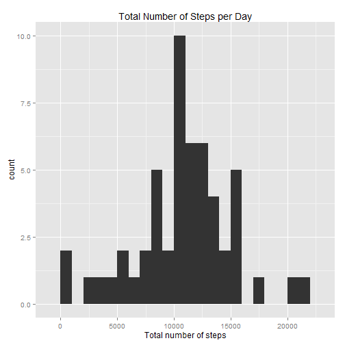

# Reproducible Research: Peer Assessment 1


## Loading and preprocessing the data
Note: I assume that we already are in the correct working directory.

The data file contains three variables:

1. **steps**: Number of steps taking in a 5-minute interval. Missing values are
coded as NA.
2. **date**: The date on which the measurement was taken in YYYY-MM-DD format.
3. **interval**: Identifier for the 5-minute interval in which the measurement was
taken.

We read the data directly from the zipped file. We also convert the **date**
values to type Date (just in case).

```r
data <- read.csv(unz(description = "activity.zip", filename = "activity.csv"))
data$date <- as.Date(data$date, "%Y-%m-%d")
```


## What is mean total number of steps taken per day?
We plot a histogram of the number of total steps taken each day, ignoring the
NA values:

```r
library(ggplot2)
```

```
## Warning: package 'ggplot2' was built under R version 3.1.1
```

```r
library(scales)
```

```
## Warning: package 'scales' was built under R version 3.1.1
```

```r
data2 <- na.omit(data)
df <- aggregate(x = list(sumsteps = data2$steps), by = list(date = data2$date),
      FUN = sum)
df$date <- as.Date(df$date)

ggplot(df, aes(x = date, y = sumsteps)) +
       geom_histogram(stat="identity") +
       xlab("Day") + ylab("Total number of steps") +
       theme(axis.text.x = element_text(angle = 45, hjust = 1, vjust = 1)) +
       scale_x_date(labels = date_format("%Y %b %d")) +
       ggtitle("Total Number of Steps per Day")
```

 

We can compute the **mean** and the **median** in two ways:

1. We can use the *summary()* function on the data.frame used above for the
  plot, and extract the data we want:
  
  ```r
  summary(df$sumsteps)
  ```
  
  ```
  ##    Min. 1st Qu.  Median    Mean 3rd Qu.    Max. 
  ##      41    8840   10800   10800   13300   21200
  ```
  
  ```r
  summary(df$sumsteps)["Mean"]
  ```
  
  ```
  ##  Mean 
  ## 10800
  ```
  
  ```r
  summary(df$sumsteps)["Median"]
  ```
  
  ```
  ## Median 
  ##  10800
  ```
  (The R console returns Mean = 10770 and Median = 10760)
2. We can use the *mean()* and *median()* functions:
  
  ```r
  mean(df$sumsteps)
  ```
  
  ```
  ## [1] 10766
  ```
  
  ```r
  median(df$sumsteps)
  ```
  
  ```
  ## [1] 10765
  ```
  (The R console returns Mean = 10766.19 and Median = 10765)

The values given by *summary()* seem to somewhat rounded (and *knitr* seems to
return rounded values too).


## What is the average daily activity pattern?
(I must say I am not sure if I understand correctly the question here...)

Let's just average the number of steps by 5-minute intervals, without taking
into account the day each interval belongs to.

```r
library(ggplot2)

data2 <- na.omit(data)
df <- aggregate(x = list(meansteps = data2$steps),
      by = list(interval = data2$interval),
      FUN = mean)

ggplot(df, aes(x = interval, y = meansteps)) +
       geom_line() +
       xlab("5-minute interval") + ylab("Average number of steps") +
       ggtitle("Average Number of Steps across all Days")
```

 

The maximum of the mean of the number of steps is contained in a 5-minute interval:

```r
m <- max(df$meansteps)
d <- df[df$meansteps == m, ]
d$interval
```

```
## [1] 835
```

Or as a one-liner:

```r
df[df$meansteps == max(df$meansteps), ]$interval
```

```
## [1] 835
```

Or as a cleaner one-liner:

```r
df[which.max(df$meansteps), ]$interval
```

```
## [1] 835
```


## Imputing missing values
The dataset contains missing values, i.e. rows that are not complete cases:

```r
sum(!complete.cases(data))
```

```
## [1] 2304
```
Or, since we know that the NA values are only present in the **steps** column:

```r
sum(is.na(data$steps))
```

```
## [1] 2304
```

To fill the missing data, let's just use the mean of steps for that 5-minute
interval:

```r
df <- aggregate(x = list(meansteps = data2$steps),
      by = list(interval = data2$interval),
      FUN = mean)
df$meansteps <- round(df$meansteps)
data3 <- merge(data, df)
# Replace NA steps value with meansteps value
data3[is.na(data3$steps), ]$steps <- data3[is.na(data3$steps), ]$meansteps
# Drop the meansteps column
data3 <- within(data3, rm("meansteps"))
```

Now we basically copy-paste the first part of the assignment, but we use *data3* as
the dataset:

```r
library(ggplot2)
library(scales)

df <- aggregate(x = list(sumsteps = data3$steps), by = list(date = data3$date),
      FUN = sum)
df$date <- as.Date(df$date)

ggplot(df, aes(x = date, y = sumsteps)) +
       geom_histogram(stat="identity") +
       xlab("Day") + ylab("Total number of steps") +
       theme(axis.text.x = element_text(angle = 45, hjust = 1, vjust = 1)) +
       scale_x_date(labels = date_format("%Y %b %d")) +
       ggtitle("Total Number of Steps per Day")
```

 

```r
mean(df$sumsteps)
```

```
## [1] 10766
```

```r
median(df$sumsteps)
```

```
## [1] 10762
```
The values of the mean and the median are really close to those computed in the
first part of the assignment:

- Mean: 10766 here vs 10766 there above
- Median: 10762 here vs 10765 there above


## Are there differences in activity patterns between weekdays and weekends?
New factor variable:

```r
wend <- weekdays(data3$date) %in% c("Saturday", "Sunday") 
wend[wend == TRUE] <- "weekend"
wend[wend == FALSE] <- "weekday"
data4 <- cbind(data3, wend)
```


```r
library(ggplot2)

df <- aggregate(x = list(meansteps = data4$steps),
      by = list(interval = data4$interval, weekend = data4$wend),
      FUN = mean)

ggplot(df, aes(x = interval, y = meansteps)) +
       geom_line() +
       facet_grid(. ~ weekend) +
       facet_wrap(~ weekend, ncol = 1) +
       xlab("Interval") + ylab("Average number of steps") +
       ggtitle("Number of Steps")
```

 

The activity during the weekend seems to be higher then during the weekdays.

<hr>
